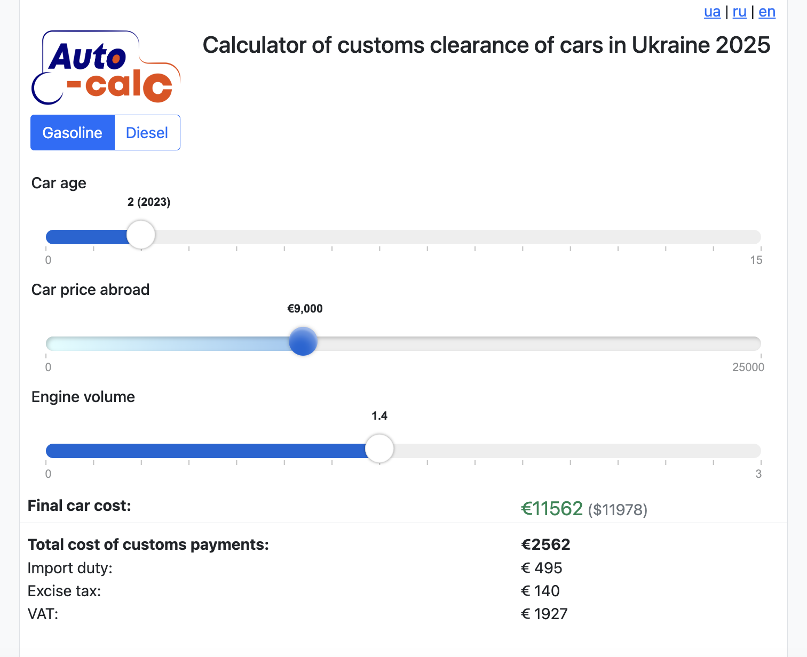
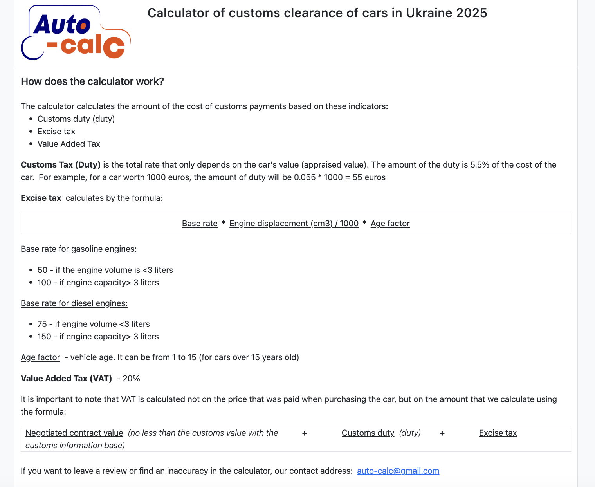

## Project Status

**⚠ This project is no longer maintained** due to the loss of its relevance. However, the codebase remains available as a part of past experience and may still be of interest.

## About the Project

This project may be useful for car enthusiasts involved in importing vehicles from the EU to Ukraine. Its main purpose is to help determine whether a specific car is worth purchasing for resale in Ukraine.

## Usage Example

Imagine you find a 2019 Volkswagen Polo for sale at €9,000. Your goal is to evaluate its profitability for resale.

1. Select the vehicle's age (assuming it's currently 2021, the car is 2 years old).
2. Enter the purchase price (€9,000).
3. Input the engine volume (e.g., 1.4L gasoline).

The calculator will automatically compute the total customs clearance costs. As a result, the final price of the vehicle in Ukraine is estimated at **€11,562** or **$11,978**.

With this final price (excluding fuel and travel expenses), you can check Ukrainian car marketplaces to compare it with local listings and decide whether the purchase is profitable.

## Features

- The website supports three languages: **Ukrainian, Russian, and English**.
- The "More about calculator" page provides the formula used to calculate customs fees.
- The final price is displayed in both **euros and dollars**, based on the exchange rate from [www.ecb.europa.eu](https://www.ecb.europa.eu) for the current day (with a possible 1-day delay).

## Technologies Used

- **Ruby 2.7.4**
- **Sinatra**
- **Puma**
- **Slim, Sass, Sinatra-Asset-Pipeline, Bootstrap**
- **JavaScript (no frameworks)**
- **Nokogiri** (for parsing the ECB website for exchange rates)

## Installation

To set up and run the project locally, follow these steps:

1. Clone the repository:
   ```sh
   git clone git@github.com:vbeliaiev/customs_car_calculator.git
   ```

2. Install Ruby and dependencies:
   ```sh
   bundle install
   ```

3. Create the necessary directory:
   ```sh
   mkdir tmp/
   ```

4. Start the server:
   ```sh
   rackup -p 4567
   ```

## Screenshots

Here are some screenshots of the application:

### Calculator Main Page


### Customs Fee Calculation Page


## License

This project is open-source and available under the MIT License. Feel free to use, modify, and distribute it as needed.
